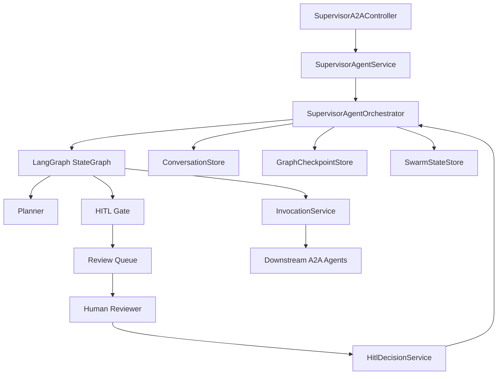

# 31. Supervisor HITL + Graph/Swarm State Hybrid MVP 아키텍처

## 1) MVP 목표

- Supervisor 실행 흐름에 `HITL 승인 게이트`를 삽입
- Graph는 실행 제어, Swarm State는 공유 상태/감사 이력 관리
- 기존 A2A 계약(`message/send`, `message/stream`, `tasks/*`)과 호환 유지
- 이번 차례 의사결정 범위는 `승인(APPROVE)/취소(CANCEL)`만 지원
- handoff는 feature flag(`handoff.enabled`) 기반으로 점진 적용(기본 OFF)

---

## 2) MVP 컴포넌트 구조



---

## 3) Graph 실행 흐름 (HITL 포함)

1. `PLAN`: 라우팅 계획 생성
2. `RISK_ASSESS`: 정책 평가(리스크 점수, 민감도)
3. `HITL_GATE`: 승인 필요 여부 분기
4. `WAIT_REVIEW`: 승인 대기(타임아웃 가능)
5. `APPLY_REVIEW`: approve/cancel 반영
6. `SELECT -> INVOKE -> MERGE`
7. `COMPOSE -> COMPLETED`

handoff 확장 규칙(34 반영):

- `INVOKE` 이후 `HANDOFF_EVALUATE` 분기 수행
- `handoff.enabled=false`면 `HANDOFF_SKIPPED_BY_FLAG`로 기록 후 기존 경로 유지
- `handoff.enabled=true`면 allowlist/method enum/stream capability/hop-limit 검증 후 `HANDOFF_APPLY`

분기 규칙:

- `risk < threshold`: 자동 진행
- `risk >= threshold`: `WAIT_REVIEW`
- `review=cancel`: 종료(`FAILED` 또는 정책 응답)

---

## 4) 상태 스키마 (Hybrid)

MVP는 하나의 루트 문서에 `graph`와 `swarm`을 분리 저장한다.

```json
{
  "schemaVersion": "1.0.0",
  "sessionId": "sess-abc",
  "taskId": "sup-task-123",
  "meta": {
    "createdAt": "2026-04-12T10:00:00Z",
    "updatedAt": "2026-04-12T10:00:10Z",
    "stateVersion": 7
  },
  "graph": {
    "currentNode": "HITL_WAITING",
    "routingIndex": 0,
    "routingPlans": [
      {
        "agentKey": "reservation",
        "method": "message/send",
        "priority": 1,
        "reason": "예약 정책 확인 필요",
        "arguments": {
          "date": "2026-04-15"
        }
      }
    ],
    "downstreamResults": [],
    "resumeFromNode": "APPLY_REVIEW"
  },
    "swarm": {
      "sharedFacts": {
        "userIntent": "환불/변경 요청",
        "riskScore": 0.86,
        "sensitiveDomain": "billing",
        "handoffHopCount": 1,
        "handoffPath": ["search", "product"],
        "lastHandoffAgent": "product"
      },
    "agentMemory": {
      "planner": {
        "confidence": 0.61
      }
    },
    "eventLog": [
      {
        "type": "RISK_EVALUATED",
        "at": "2026-04-12T10:00:05Z",
        "payload": {
          "riskScore": 0.86
        }
      },
      {
        "type": "HANDOFF_APPLIED",
        "at": "2026-04-13T10:00:07Z",
        "payload": {
          "fromAgent": "search",
          "toAgent": "product",
          "reason": "domain_delegate",
          "handoffEnabled": true
        }
      }
    ]
  },
  "hitl": {
    "required": true,
    "status": "WAITING",
    "policyId": "HITL-POL-01",
    "reviewerId": "",
    "decision": "",
    "decisionReason": "",
    "requestedAt": "2026-04-12T10:00:06Z",
    "expiresAt": "2026-04-12T10:05:06Z",
    "decisionId": ""
  }
}
```

---

## 5) HITL 정책 매트릭스 (MVP)

| Policy ID | 조건 | 액션 | 타임아웃 | 타임아웃 후 |
|---|---|---|---|---|
| HITL-POL-01 | `riskScore >= 0.8` | 승인 대기 | 5분 | reject |
| HITL-POL-02 | 법률/환불/개인정보 키워드 포함 | 승인 대기 | 10분 | reviewer 재할당 |
| HITL-POL-03 | 연속 downstream 실패(2회 이상) | 수동 승인 후 재시도 | 3분 | fallback 응답 |
| HITL-POL-04 | 상품/예약/주문 등 데이터 생성·변경 요청(create/update/delete) | 승인 대기(강제) | 5분 | reject |

결정 타입:

- `APPROVE`: 기존 plan으로 계속 진행
- `CANCEL`: 실행 중단 및 사용자 응답 종료

주의:

- `HITL-POL-04`는 점수 기반이 아닌 강제 규칙이다.
- 예: 상품 생성, 예약 생성/취소 요청은 항상 human decision 이후에만 실행된다.

---

## 6) A2A/API 확장안 (MVP)

- A2A 계약은 `legacy`와 `v1.0`을 모두 지원한다(메서드 enum 기반 호환 유지).
- 신규 JSON-RPC 메서드
  - `tasks/review/get`: 리뷰 대기 상태 조회
  - `tasks/review/decide`: 승인/취소 제출
- 기존 `tasks/get` 응답 확장
  - `status=WAITING_REVIEW`
  - `hitl` 블록(정책ID, 만료시각, 현재 결정 상태)

요청 예시(`tasks/review/decide`):

```json
{
  "jsonrpc": "2.0",
  "id": "rv-1",
  "method": "tasks/review/decide",
  "params": {
    "taskId": "sup-task-123",
    "decisionId": "dec-20260412-001",
    "decision": "APPROVE",
    "reason": "고객 정책 확인 완료"
  }
}
```

---

## 7) MVP 수용 기준

1. 고위험 요청은 `WAITING_REVIEW`로 전이되고 실행이 정지된다.
2. `APPROVE/CANCEL` 입력 시 상태 전이가 정확히 반영된다.
3. 승인 후 resume 시 중복 downstream 호출이 발생하지 않는다.
4. 장애 후 재시작 시 Swarm State + Checkpoint로 동일 지점 복원된다.
5. 기존 non-HITL 요청은 기존 지연/기능 수준을 유지한다.
6. handoff OFF 상태에서는 기존 non-handoff 경로와 동등 동작을 유지한다.

---

## 8) 향후 계획 (Next Phase)

- 사용자 정보 입력 수집 플로우
  - 예: 이름/전화번호/이메일을 자연어 또는 콤마 텍스트로 입력
  - 서버에서 파싱/검증 후 내부 JSON DTO로 구조화
- `tasks/review/decide`의 `REVISE` 결정 타입 확장
  - 검토자가 파라미터를 수정해 재실행하는 고급 승인 플로우
- handoff 고도화
  - sourceType 기반 실행 경로 분석
  - handoff 지표 기반 정책 자동 튜닝

---

## 9) 비목표 (MVP Out of Scope)

- 다단계 승인(2인 이상 체인)
- 외부 티켓 시스템(Jira/ServiceNow) 연동
- ML 기반 동적 임계치 자동튜닝
