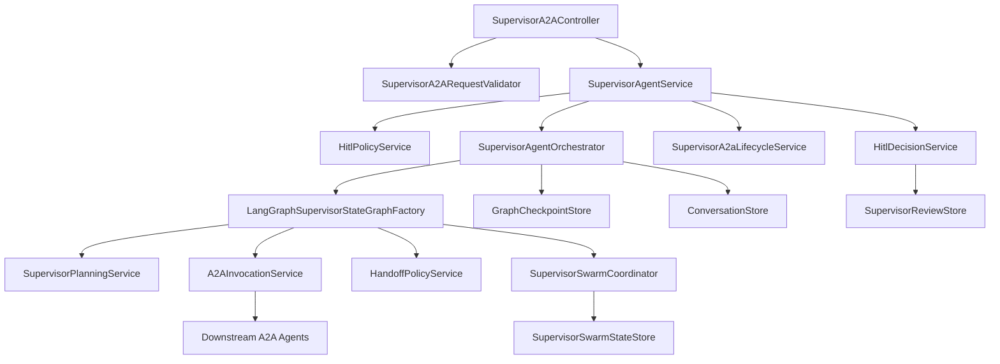

# 31. Supervisor HITL + Graph/Swarm State Hybrid 현재 아키텍처

## 1) 문서 목적

본 문서는 현재 `com.example.springsupervisorai` 구현을 기준으로 supervisor의 HITL, LangGraph, SwarmState, handoff 연계를 설명한다.

- 기준 소스
  - `src/main/java/com/example/springsupervisorai/service/SupervisorAgentService.java`
  - `src/main/java/com/example/springsupervisorai/service/SupervisorAgentOrchestrator.java`
  - `src/main/java/com/example/springsupervisorai/service/agent/graph/LangGraphSupervisorStateGraphFactory.java`
  - `src/main/java/com/example/springsupervisorai/service/agent/hitl/*`
  - `src/main/java/com/example/springsupervisorai/service/agent/swarm/*`
- 범위
  - unary/stream 진입점
  - HITL review 대기 및 승인 재개
  - graph checkpoint + swarm state 저장
  - downstream handoff 평가/적용

---

## 2) 현재 컴포넌트 구조

핵심 차이점:

- HITL 평가는 graph 내부가 아니라 `SupervisorAgentService` 진입 시점에서 먼저 수행한다.
- review가 필요하면 task를 `WAITING_REVIEW`로 생성하고 graph 실행 자체를 시작하지 않는다.
- 승인 후 `decideReview(APPROVE)`가 호출되면 task를 `RUNNING`으로 전이하고 오케스트레이션을 새로 시작한다.

---

## 3) 실제 실행 흐름

### 3.1 `message/send`

1. 컨트롤러가 JSON-RPC precheck 및 params 검증 수행
2. `PromptInjectionGuard`로 입력 sanitize
3. `HitlPolicyService.evaluate(...)` 실행
4. review 필요 시
   - `SupervisorA2aLifecycleService.createAndMarkWaitingReview(...)`
   - `HitlDecisionService.openReview(...)`
   - `TaskView(status=WAITING_REVIEW)` 반환
5. review 불필요 시
   - task를 `RUNNING`으로 생성
   - `SupervisorAgentOrchestrator.execute(...)` 수행
   - 결과 payload를 task 완료 상태에 반영

### 3.2 `message/stream`

1. 초기에 `stage=hitl` 진행 이벤트를 먼저 전송
2. HITL 필요 시
   - task/review 생성
   - `stage=hitl_waiting` 이벤트로 종료
3. HITL 통과 시
   - task를 `RUNNING`으로 생성
   - 오케스트레이터 progress + compose stream을 SSE로 전달
   - A2UI payload는 `event: a2ui`, 일반 텍스트는 `event: chunk`

### 3.3 `tasks/review/*`

- `tasks/review/get`: review ticket 조회
- `tasks/review/decide`
  - `APPROVE`: 대기 task를 `RUNNING`으로 전이하고 오케스트레이션 재개
  - `CANCEL`: task를 취소 상태로 종료

현재 review 결정 타입은 `APPROVE`, `CANCEL`만 허용한다.

---

## 4) LangGraph 상태 흐름

현재 graph는 아래 순서로 구성되어 있다.

1. `PLAN`
2. `SELECT`
3. `INVOKE`
4. `HANDOFF_EVALUATE`
5. `HANDOFF_APPLY`
6. `MERGE`
7. `SELECT` 반복
8. `COMPOSE`

그래프 종료 조건:

- 더 이상 실행할 `RoutingPlan`이 없음
- 또는 `routingIndex >= maxConcurrency/planCount/MAX_ITERATIONS` 조건으로 compose 분기

`SupervisorRuntimeState` 기준 상태값:

- `REQUEST_VALIDATED`
- `HISTORY_LOADED`
- `PLANNED`
- `ROUTING_SELECTED`
- `A2A_CALLING`
- `HANDOFF_EVALUATING`
- `HANDOFF_APPLIED`
- `HANDOFF_SKIPPED`
- `A2A_RESULT_MERGED`
- `COMPOSING`
- `COMPLETED`

`SupervisorAgentOrchestrator`는 위 상태 일부를 checkpoint 문자열(`state=...;at=...`)로 저장/복구한다.

---

## 5) HITL 현재 동작

### 5.1 정책 평가

기본 구현체는 `LlmHitlPolicyService`이다.

- LLM에 policy prompt를 보내 JSON 계약을 받는다.
- `intentType=data_mutation`이면 강제 review
- 그 외에는
  - `reviewRequired=true`
  - `riskScore >= 0.65`
  - `intentType != read_only`
  조건일 때 review 필요
- 파싱 1차 실패 시 repair prompt를 한 번 더 시도
- 최종 실패 시 현재 구현은 blocking fail-safe 대신 `notRequired()`로 폴백한다.

### 5.2 리뷰 저장과 상태 반영

`DefaultHitlDecisionService`는 review 저장소와 swarm 상태를 함께 갱신한다.

- review open 시 shared facts
  - `hitlRequired=true`
  - `policyId`
  - `policyReason`
- review decide 시 shared facts
  - `hitlDecision`
  - `decisionReason`

리뷰 만료 시간은 현재 고정 30분이다.

---

## 6) SwarmState 현재 역할

SwarmState는 graph checkpoint를 대체하지 않는다. 현재 역할은 아래 두 가지다.

1. 공유 facts 저장
   - 최근 invoke 성공/실패 수
   - cooldown/circuit open 정보
   - handoff hop/path/window 정보
   - hitl 정책/결정 정보
2. 이벤트 로그 저장
   - graph node 실행 이력
   - invoke batch 결과
   - handoff 요청/승인/차단
   - hitl review open/decide

현재 저장 구조는 `taskId` 단위 스냅샷이며, `sessionId`로 latest 조회를 지원한다.

---

## 7) Handoff 현재 동작

handoff는 현재 구현되어 있으며 feature flag로 제어된다.

### 7.1 평가 단계

`HANDOFF_EVALUATE`에서 수행하는 일:

- 직전 invoke 배치 결과에서 handoff directive 추출
- `HandoffPolicyService`로 검증
- accepted/rejected/skipped-by-flag 결과를 SwarmState에 기록

### 7.2 적용 단계

`HANDOFF_APPLY`에서 수행하는 일:

- accepted 된 `RoutingPlan`만 현재 routing queue에 삽입
- rejected 된 건은 기존 plan을 유지하고 fallback 이벤트를 남김
- 적용 결과에 따라 runtime state를
  - `HANDOFF_APPLIED`
  - `HANDOFF_SKIPPED`
  로 갱신

### 7.3 정책 제약

설정 위치: `host.a2a.handoff`

- `enabled`
- `maxHops`
- `blockSameAgentWithinSteps`
- `maxPerMinute`
- `allowMethods`

검증 규칙:

- 라우팅 allowlist에 존재하는 agent만 허용
- 허용 메서드만 허용
- 최근 경로 중복 차단
- hop 수 제한
- 분당 handoff 수 제한
- stream capability 검증

---

## 8) 진행 이벤트와 사용자 노출

진행 이벤트는 `SupervisorProgressSupport.line(...)` 포맷으로 통일되어 있다.

대표 stage:

- `initializing`
- `hitl`
- `hitl_waiting`
- `planning`
- `invoking`
- `handoff`
- `handoff_skipped`
- `handoff_applied`
- `composing`
- `completed`
- `error`

handoff 단계는 graph 내부에서 swarm event metadata로도 함께 남기며, compose 완료 후 최종 `completed` 진행 이벤트가 추가된다.

---

## 9) 현재 구현의 제약

- HITL은 사전 게이트 방식이며 graph 내부 `WAIT_REVIEW` 노드는 없다.
- review 승인 후 resume은 checkpoint 재개가 아니라 승인 시점의 새 오케스트레이션 실행이다.
- `REVISE` 같은 고급 review 결정 타입은 아직 없다.
- A2UI transport는 supervisor 전용 SSE 위에 얹혀 있으며 순수 A2UI transport 단일화는 아직 아니다.

---

## 10) 문서 동기화 결론

현재 supervisor는 "사전 HITL 게이트 + LangGraph 실행 + SwarmState 감사/공유 상태 + 선택적 handoff + 선택적 A2UI" 구조로 동작한다.

즉, 초기 설계안의 많은 요소가 구현되었지만 실제 구현 방식은 아래와 같이 정리하는 것이 정확하다.

- HITL은 graph 내부 대기 노드가 아니라 service 레벨 사전 차단 방식
- graph는 `PLAN -> SELECT -> INVOKE -> HANDOFF_* -> MERGE -> COMPOSE`
- SwarmState는 checkpoint 대체가 아니라 공유 facts/event log 저장소
- handoff는 이미 적용되었고 기본값은 `enabled=false`
